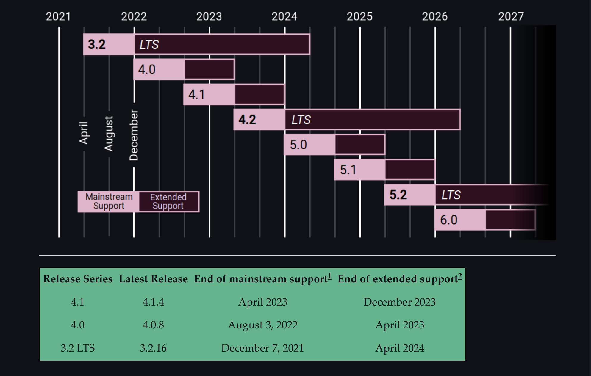

# BLOG APPLICATION :><:

# Django and Python Version for project.

    Django - 4.2
    Python - 3.8.10

***
***
## LTS support for Django.

***
***
## LTS support for Python

***
***
# Dev Responses
- [x] [Django LTS versions](https://www.djangoproject.com/download/)
- [x] [Python LTS versions](https://www.python.org/downloads/)

[//]: # (## Test and Deploy)

***
***
## PROJECT DESCRIPTION:

Blog Application : Create a complete blog application

1. Build data models, views, and URLs.
2. Implement an administration site for your blog.
3. Use canonical URLs for models and implement SEO-friendly URLs for posts.
4. Build post pagination and learn how to create class-based views.
5. Use forms to allow readers to share posts via email and implement a comment system using model forms.
6. Add tags to posts using django-taggit and recommend similar posts based on shared tags.
7. Implement custom template tags to display latest posts and most commented posts.
8. Implement a custom template filter to render Markdown.
9. Create a sitemap and a RSS feed for your blog.
10. Implement a full-text search engine using PostgreSQL.

***
***

# Dev Note:

***
***

